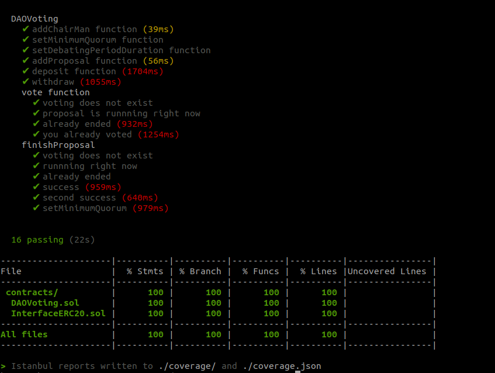

# Tasks
```shell
npx hardhat addProposal --title <string: title of function> --address <string: address of contract> --value <integer of string: value which set to function> --description <string> --network <localhost or goerli>
```
```shell
npx hardhat deposit --funds <integer: number of tokens> --network <localhost or goerli>
```
```shell
npx hardhat finish --id <integer: id of voting> --network <localhost or goerli>
```
```shell
npx hardhat vote --id <integer: id of voting> --value <false or true: choose of voting> --network <localhost or goerli>
```

# Examples of tasks
```shell
npx hardhat addProposal --title "setMinimumQuorum(uint256)" --address 0x7c098E457DA8108527bdba11da981100d5293A92 --value 3 --description "change value" --network goerli
```

```shell
npx hardhat deposit --funds 100 --network goerli
```

```shell
npx hardhat finish --id 1 --network goerli
```

```shell
npx hardhat vote --id 0 --value true --network goerli
```
# Tests
